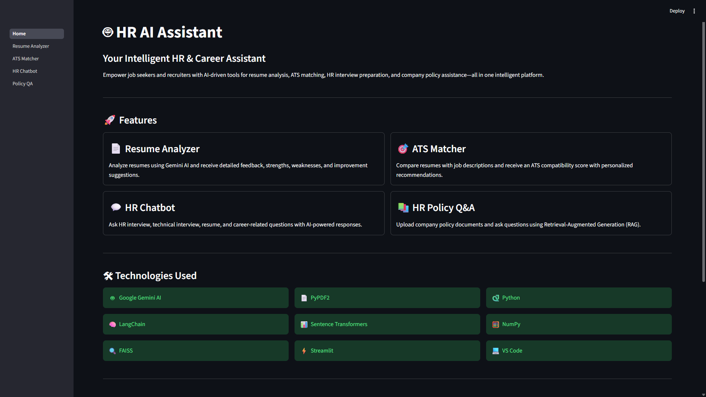
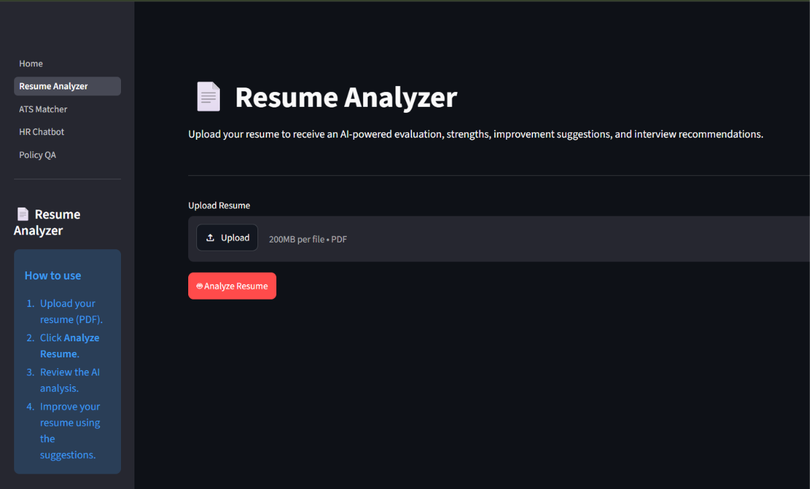
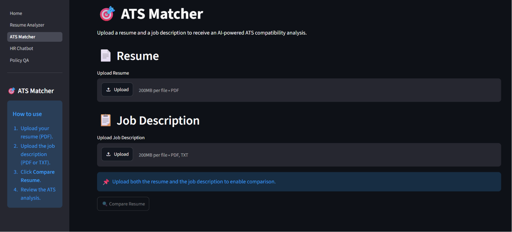
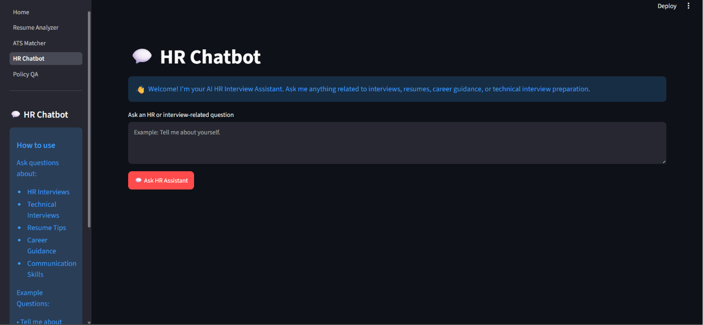
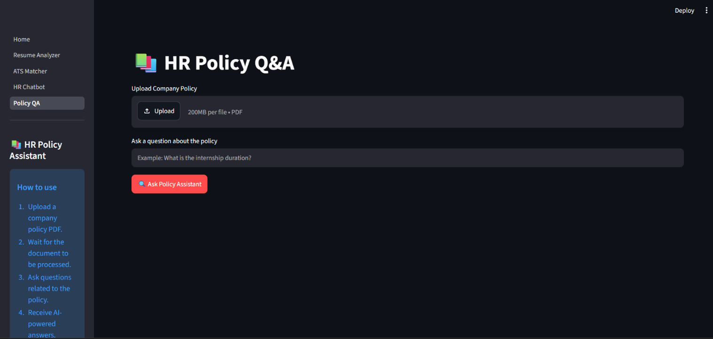

# 🤖 HR AI Assistant


An AI-powered web application that helps **job seekers, students, and recruiters** analyze resumes, evaluate ATS compatibility, prepare for HR interviews, and search company policies using **Google Gemini AI** and **Retrieval-Augmented Generation (RAG)**.

---

## 🚀 Features

### 📄 Resume Analyzer
- AI-powered resume evaluation
- Resume score with detailed feedback
- Strengths and weaknesses analysis
- Resume improvement suggestions
- Interview recommendation

### 🎯 ATS Matcher
- Compare resumes with job descriptions
- ATS compatibility score
- Matching and missing skills
- Strengths and weaknesses analysis
- Personalized improvement suggestions

### 💬 HR Chatbot
- HR interview preparation
- Technical interview guidance
- Resume and career advice
- Communication skill improvement
- Beginner-friendly technical explanations

### 📚 HR Policy Q&A
- Upload company policy documents
- Ask natural language questions
- Retrieval-Augmented Generation (RAG)
- Context-aware answers from uploaded PDFs

---

## 🛠 Tech Stack

### Frontend
- Streamlit

### Backend
- Python

### AI & Machine Learning
- Google Gemini AI
- LangChain
- Sentence Transformers
- FAISS

### Document Processing
- PyPDF2
- NumPy

---

## 📂 Project Structure

```text
HR-AI-Assistant/
│
├── assets/
│   ├── home.png
│   ├── resume_analyzer.png
│   ├── ats_matcher.png
│   ├── hr_chatbot.png
│   └── policy_qa.png
│
├── backend/
│   ├── __init__.py
│   ├── chatbot.py
│   ├── jd_match.py
│   ├── rag.py
│   ├── resume.py
│   └── utils.py
│
├── pages/
│   ├── 1_Resume_Analyzer.py
│   ├── 2_ATS_Matcher.py
│   ├── 3_HR_Chatbot.py
│   └── 4_Policy_QA.py
│
├── Home.py
├── config.py
├── requirements.txt
├── .env
├── .gitignore
└── README.md
```

---

## ⚙️ Installation

### Clone the repository

```bash
git clone https://github.com/rajatojha19/HR-AI-Assistant.git
```

### Navigate to the project

```bash
cd HR-AI-Assistant
```

### Create a virtual environment

```bash
python -m venv venv
```

### Activate the virtual environment

**Windows**

```bash
venv\Scripts\activate
```

**macOS/Linux**

```bash
source venv/bin/activate
```

### Install dependencies

```bash
pip install -r requirements.txt
```

---

## 🔑 Environment Variables

Create a `.env` file in the project root.

```env
GEMINI_API_KEY=your_google_gemini_api_key
```

---

## ▶️ Run the Application

```bash
streamlit run Home.py
```

---

## 📸 Screenshots

### 🏠 Home



---

### 📄 Resume Analyzer



---

### 🎯 ATS Matcher



---

### 💬 HR Chatbot



---

### 📚 HR Policy Q&A



---

## 👨‍💻 Author

**Rajat Ojha**

B.Tech Undergraduate | Computer Science & Engineering (AI & ML)

Passionate about Artificial Intelligence, Generative AI, Machine Learning, Software Development.

---

## 📬 Connect with Me

- **GitHub:** https://github.com/rajatojha19
- **Email:** rajatojha2050@gmail.com
- **LinkedIn:** https://www.linkedin.com/in/rajat-ojha-95b7072a8/
---

## 📄 License

This project is licensed under the MIT License.